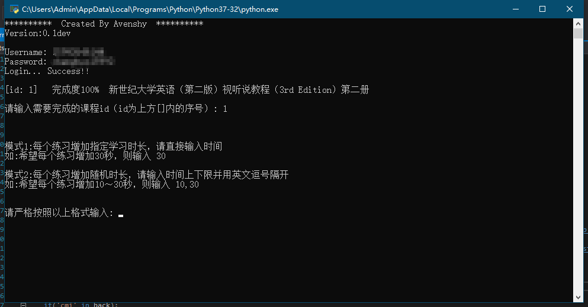

# WELearnToSleeep
WeLearn刷学习时长  
**脚本已失效，且永不更新，此页面仅作为存档**  
**本脚本仅供学习参考交流，请使用者于下载24小时内自行删除，不得用于商业用途，否则后果自负。**  
  
## 简介
* 输入账号密码一键学习
* 可以自行选择课程
* 多线程学习，同时学习整个单元
* 可以指定时间或设置随机时间

**PS:本软件只增加学习时长，如需完成课程请食用[WELearnToSleep(WeLearn一键完成课程)](https://github.com/Avenshy/WELearnToSleep)**

## 更新日志

### `v0.2dev`
* 支持学习指定单元了
* 修复没有记录错误的bug

### `v0.1dev`
* 敲出首个版本的代码
